# Experiment 1.2

### Problem Definition:
**Target**

Prediction of trend direction over next t=[5, 10, 15, 20, 30, 60, 120, 240, 360, 480, 720, 960, 1200] minutes for S&P 500 stocks.
For every S&P 500 stock and for every minute from 2020-01-01 until 2025-06-25 we use the linear regression slope over the window of length t and normalizes it by the mean of the window's prices.

**Input Features**

- Normalized VWAP (volume weighted average price) and volume
- Normalized exponential moving average (EMA) over t=[5, 10, 15, 20, 30, 60, 120, 240, 360, 480, 720, 960, 1200] minutes
- Slope and second order slope of EMAs

### Procedure Overview:
- Collects for all S&P 500 tickers minute bars from 2020-01-01 → 2025-06-25.
- Engineers above features for each symbol for each minute.
- Predicts direction of trend over next 30 minutes (entry-network) using feed-forward neural network ([128, 64] hidden layers, dropout 0.1, ReLU activation).
- Use decision tree (depth=10) with embeddings (hidden layer with 64 neurons) to predict entry points with positive trend direction.
- Implement trading strategy in Alpaca, that enters positions at predicted entry points and holds them for 30 minutes.

**We hope to find patterns of EMA crossovers and volume spikes that precede upward trends in stock prices.**

---

## Data Acquisition
Retrieves raw market data for S&P 500 symbols (list of S&P 500 companies as of January 2025 is provided - assumption that survival bias is minimal for intraday analysis). 

**Script**

[scripts/01_data_acquisition/bar_retriever.py](scripts/01_data_acquisition/bar_retriever.py)

Pulls **1‑minute** adjusted bars (adjusts for splits and dividends) from **2020‑01‑01 → 2025‑09‑12** and writes `symbol.parquet` files to  
`C:/Data/Datasets/Financial_Trading/2025_06_19_Trading_Template/Raw/Bars_1m/`.

Bar data AAPL example:

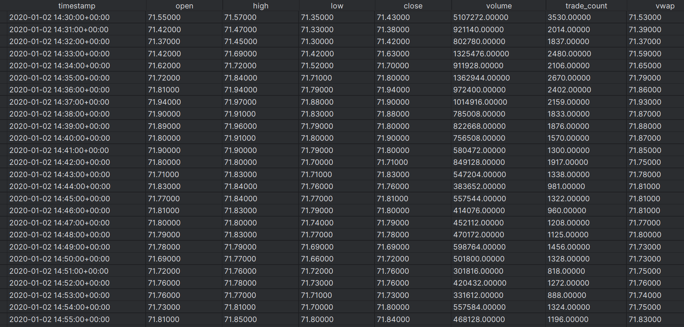

---

## Step 2 – Data Understanding
Visualizes open prices of individual stocks and explores correlations among stocks.

**Script**  

[plotter.py](scripts/02_data_understanding/plotter.py)

**Plots**  

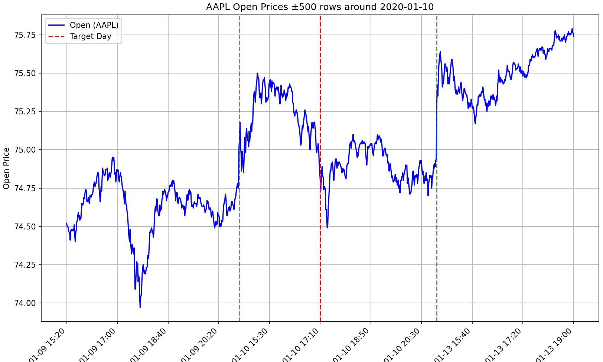
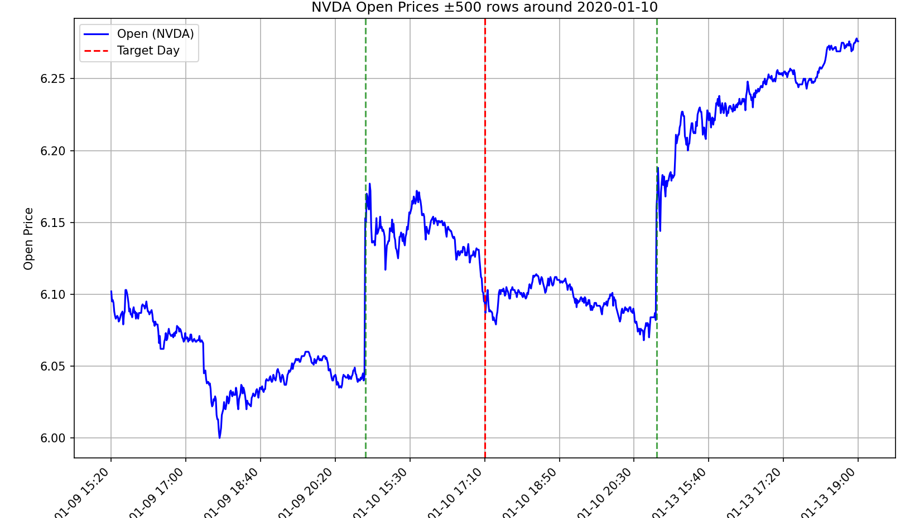

*Correlations among stocks lead to higher number of instances of particular behavior in time.*

---

## Step 3 – Pre-Split Preparation
- Compute forward-looking targets (normalized trend slope and percentage change)
- Engineer normalized technical analysis features (EMA, slopes, second-order slopes)
- Split the data into train/validation/test partitions by timestamp boundaries

**Main Script**

[main.py](scripts/03_pre_split_prep/main.py)

**Feature Engineering Script**

[scripts/03_pre_split_prep/features.py](scripts/03_pre_split_prep/features.py)

**Target Computation Script**

[scripts/03_pre_split_prep/targets.py](scripts/03_pre_split_prep/targets.py)

**Plotting Script**'

[scripts/03_pre_split_prep/plot_features.py](scripts/03_pre_split_prep/plot_features.py)

**Plots**  

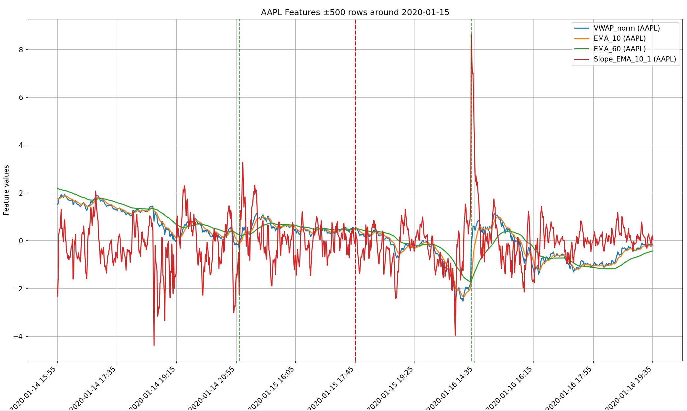

**Plot of selected features over time for AAPL.**

Data extract after feature engineering:

[features_example.csv](data/03_features_example.csv)

---

## Step 4 – Split Data
Shuffling splitted data on symbol level and global level so that batches contain data from different stocks and time periods and can easily be loaded during training.

**Script**

[shuffle.py](scripts/04_split_data/shuffle.py)

---

## Step 5 – Post-Split Preparation
No more preparation needed after splitting the dataset.

---

## Step 6 – Feature Selection
Calculate correlation matrix.

**Script**

[main.py](scripts/06_feature_selection/main.py)

**Extract Correlations**

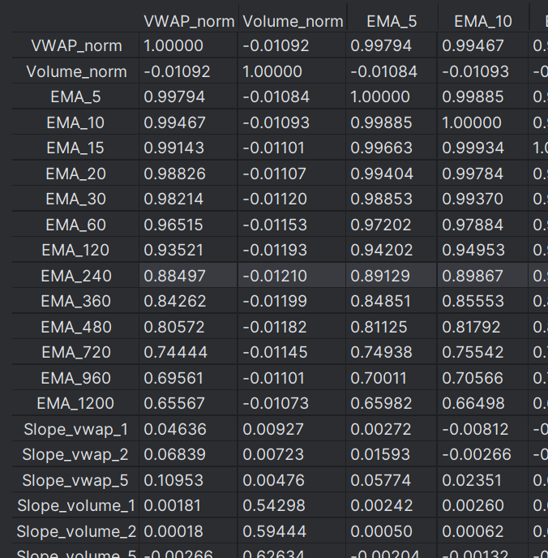

*Strong correlations between features exist. Strongly correlated features could be removed.*

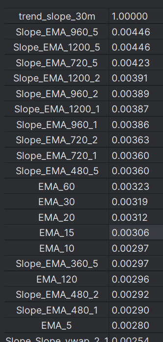

*Only weak correlations exist with target as expected due to low signal-to-noise ratio in stock price prediction problem.*

---

## Step 7 – Model Training

### Step 1:
- Loads experiment config and the engineered feature list
- Streams shuffled Parquet shards for train/validation/test via an IterableDataset
- Builds a simple MLP regressor with:
  - ReLU activations
  - Adam optimizer
  - Learning rate: 0.001
  - Batch size: 2048 
  - WEIGHT_DECAY: 0.0001
  - LR: 0.0005
  - HIDDEN1: 128
  - HIDDEN2: 64
  - DROPOUT: 0.1
- Trains with MSE loss and tracks both validation loss and a sign-accuracy metric
- Saves best checkpoints for lowest validation loss and best validation accuracy

**Script**

[feed_forward.py](scripts/07_model_training/01_feed_forward.py)

**Models**
- [best_acc_model.pt](models/best_acc_model_temp.pt)
- [best_loss_model.pt](models/best_loss_model_temp.pt)

**Plots**

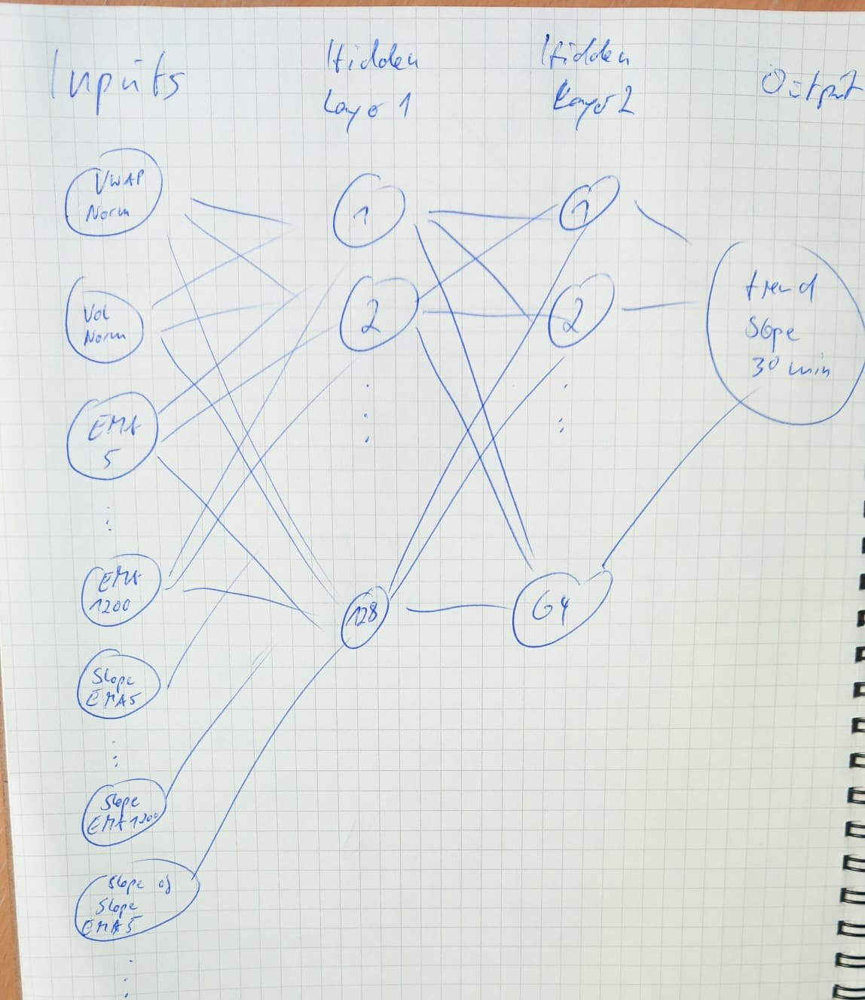

*Network architecture.*

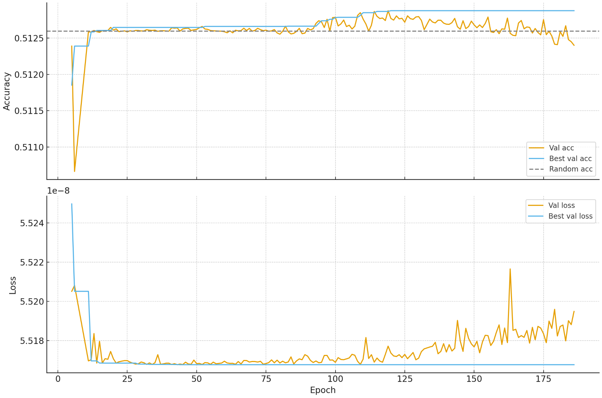

*Training and validation loss and accuracy over epochs.*

### Step 2:
Train a HoeffdingTree and traditional decision tree (see corresponding source) on embeddings from the trained MLP (best_acc_model.pt).

**Script**

[02_decision_tree.py](scripts/07_model_training/02_hoeffding_tree.py)

**Sources**

[07_Decision_Tree_vs_Hoefding_Tree.pdf](sources/07_Decision_Tree_vs_Hoeffding_Tree.pdf)

**Plots**
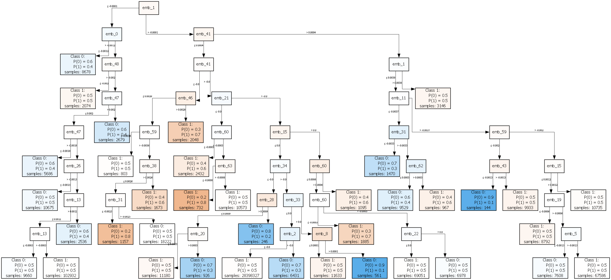

*Visualization of trained hoeffding tree.*

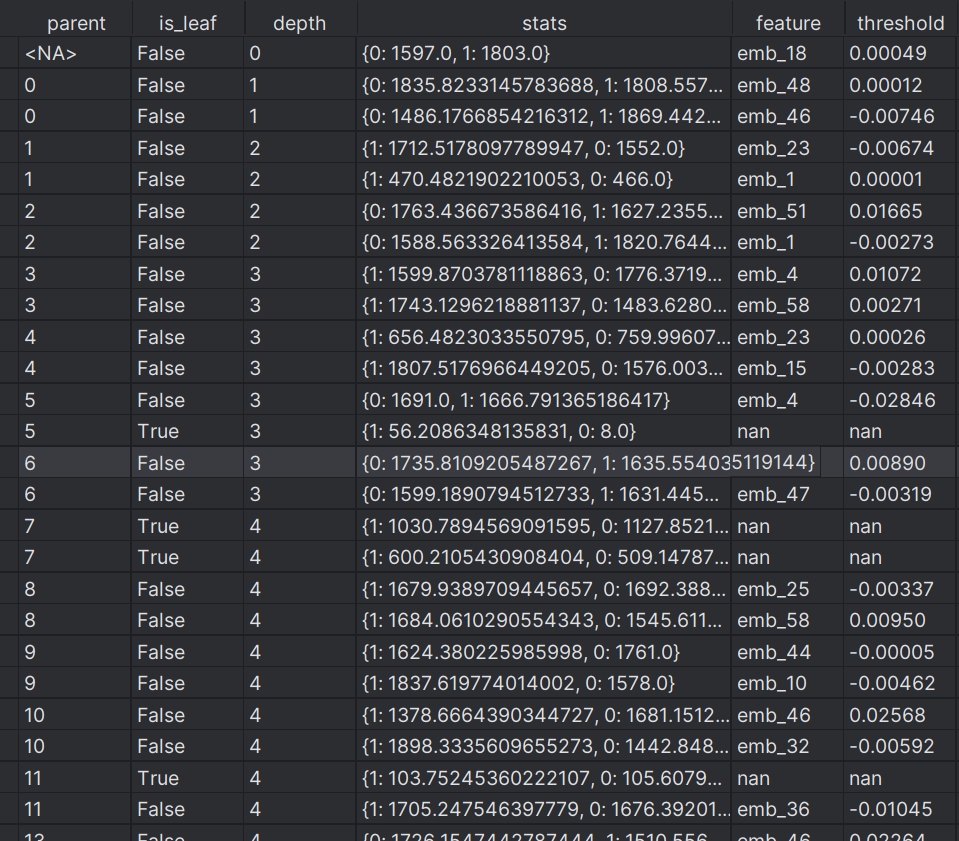

*Statistics of trained hoeffding tree.*

[07_decision_tree.png](images/07_decision_tree.png)

*Visualization of trained decision tree.*

---

## Step 8 – Model Testing
Evaluate best MLP with hoeffding and decision tree on test set.

**Scripts**

[evaluate_hoeffding.py](scripts/08_model_testing/evaluate_hoeffding.py)

**Plots**

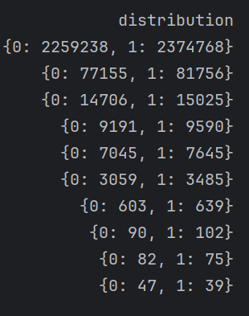

*Distributions of predicted trend slopes for selected leaf nodes of hoeffding tree on test set.*

**Scripts**

[evaluate_dt.py](scripts/08_model_testing/evaluate_dt.py)

**Data**

[08_node_subset_stats_validation.csv](data/08_node_stats_validation_dt.csv)

*Statistics of decision tree nodes on validation set.*

[08_node_subset_stats_test.csv](data/08_node_stats_test_dt.csv)

*Statistics of decision tree nodes on test set.*

Node_id=10 shows promising results with 57.3% positive trend slopes on validation and 52.9% on test set with significant number of samples.

---

## Step 9 – Deployment
Deploy trading strategy using trained feed forward network to generate embeddings and decision tree with node_id=10 to determine buy signals.

**Script**

[main.py](scripts/09_deployment/main.py)

**Plots**

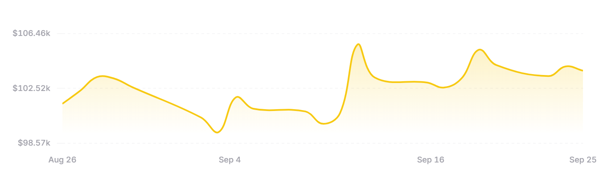

*Trading performance over the last month.*

---

## Next Steps
- Try targeting different time horizons.
- Make sure, that not same behavior at a single point in time across all symbols is learned. Remember correlation between stocks from data understanding. Entry points should be distributed over time.
- Remove entry points that are less than 3 minutes apart for same symbol.
- Given entry points from last step, calculate trend directions over next 30 minutes for all time steps within 100 minutes after entry points.
- Use calculated trend directions as target variable
- Train neural network (exit-network) with same feature space as above on given targets
- Use predictions of negative trend directions as exit points (with 100 days as max. number to hold positions)
- Explore reinforcement learning approaches.
