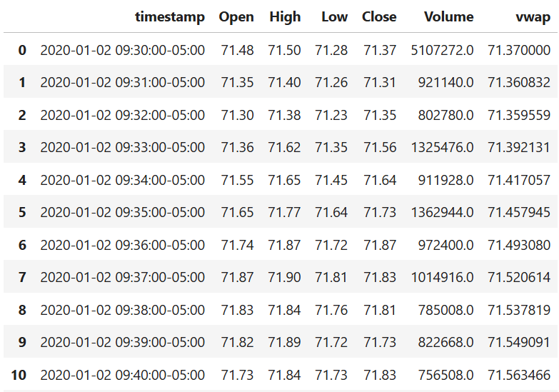
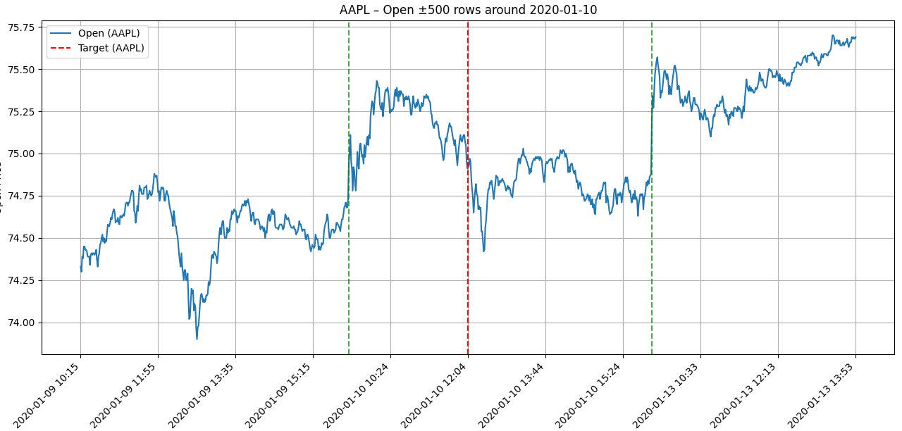
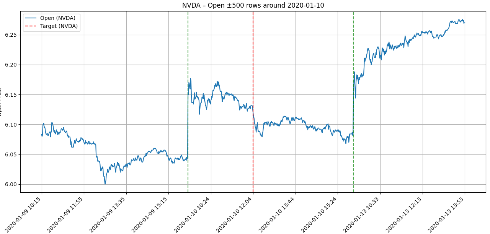
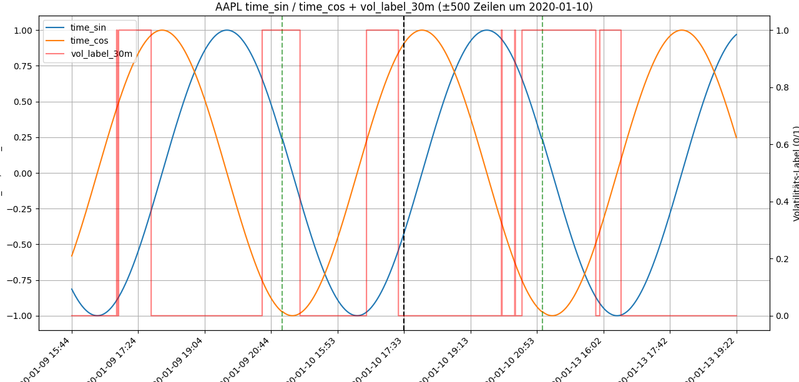
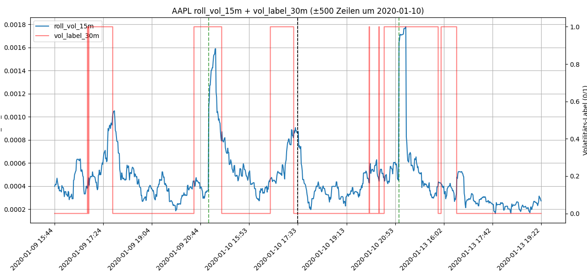
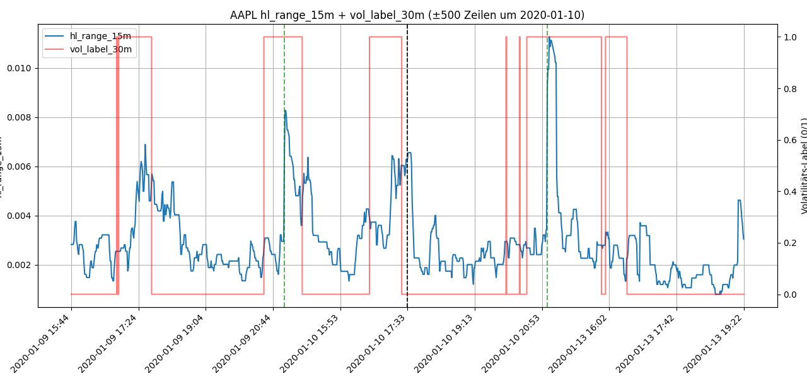
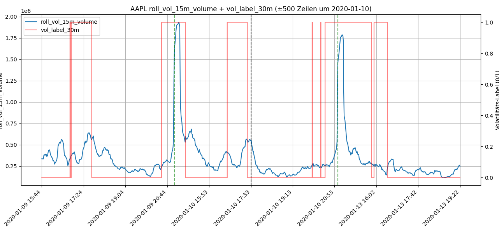
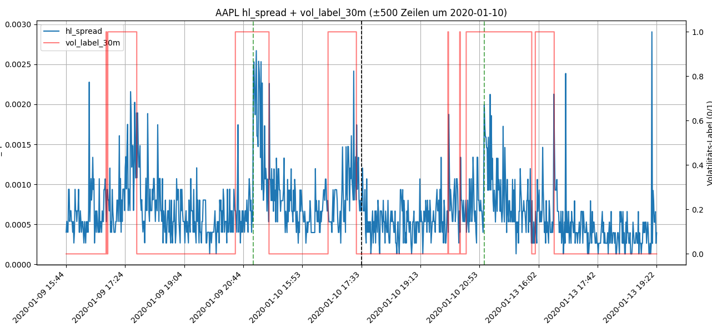
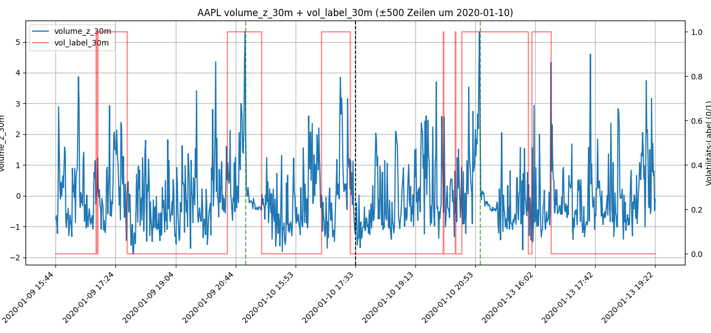

# Vorhersage kurzfristiger Volatilität von S&P-500-Aktien mittels LSTM

## Problem Definition

### Zielsetzung

In diesem Experiment soll vorhergesagt werden, ob eine **S&P-500-Aktie** in den nächsten
t = [5, 10, 15, 30, 60] Minuten **ruhig bleibt** (Low Volatility) oder **stark schwankt** (High Volatility).

Für jede Aktie und jede Minute im Zeitraum **01.01.2020 bis 25.06.2025** wird untersucht, 
ob in den nächsten Minuten eine ungewöhnlich starke Preisbewegung kommt.

### Target

Um zu bestimmen, wie stark sich eine Aktie in den nächsten Minuten bewegt, 
wird eine **Kennzahl** berechnet.

**1. Log-Renditen**
- rₖ = ln(Pₖ / Pₖ₋₁)
- Das misst die Preisänderung von einer Minute zur nächsten.

**2. Realisierte Volatilität**
- RV(τ, t) = √( Σ rₖ² )  für k = τ+1 bis τ+t
- Alle Preisänderungen in einem t-Minuten-Fenster werden zusammengefasst. Je größer dieses Ergebnis, desto stärker schwankt die Aktie.

**3. Normalisierung**
- RV_norm(τ, t) = RV(τ, t) / durchschnittliche Tagesvolatilität
- Manche Aktien sind immer sehr volatil, manche sind immer ruhig.
Durch Division durch die eigene Tagesvolatilität wird alles fair.

**4. Label-Definition**
- Die Werte werden dann sortiert. Das Modell soll jetzt 0 oder 1 vorhersagen.
- Top 30 % → High Volatility → y(τ, t) = 1
- Untere 70 % → Low Volatility → y(τ, t) = 0

### Input Features

Das Modell sieht nur Informationen, die vor Zeitpunkt τ vorhanden sind.
Als Input wird eine **30-Minuten-Sequenz** aller Merkmale genutzt.

**1. Preisbezogene Features**
- Normalisierter Schlusskurs
- 1-Minuten-Log-Return
- Rolling Return (5 Minuten)
- Rolling Volatilität (15 Minuten)

**2. VWAP & Abweichung**
- Intraday-VWAP
- Relative Abweichung vom VWAP

**3. Volumen & Liquidität**
- Normalisiertes Volumen
- Rolling-Volume (15 Minuten)
- Volumenspikes (Volume / SMA-60)

**4. Handelsbereich**
- Normalisierter High-Low-Spread
- Rolling-Range (15 Minuten)

**5. Zeitliche Merkmale**
- Minute des Handelstages (sin/cos)
- Dummy: erste 30 Minuten nach Markteröffnung
- Dummy: letzte 30 Minuten vor Handelsschluss

---

## Step 1 – Data Acquisition
- Die historischen 1-Minuten-Daten werden über die **Alpaca Market Data API** abgerufen.
- Für jede Aktie wird eine Datei {TICKER}.parquet gespeichert.

### Script

[`bar_retriever.py`](scripts/01_data_acquisition/bar_retriever.py)

---

## Step 2 – Data Understanding

Dieser Schritt visualisiert Intraday-1-Minuten-Open-Preise einzelner S&P-500-Aktien 
und untersucht ihr Verhalten um einen festen Zeitindex herum.

### Script

[`plotter.py`](scripts/02_data_understanding/plotter.py)

### Plots

*Die Volatilität ist eher hoch – besonders an den Tagesöffnungen.*

---

## Step 3 – Pre-Split Preparation

- **Targets berechnen**
  - Zukünftige realisierte Volatilität bestimmen, normalisieren und in High/Low-Volatility-Labels umwandeln.

- **Features erzeugen**
  - Preis-, Volumen-, VWAP-, Range- und Zeit-Features wie Log-Returns, Rolling-Volatilität, VWAP-Abweichung und sin/cos-Zeitkodierung berechnen.

- **Daten splitten**
  - Datensatz chronologisch in Train, Validation und Test aufteilen.

### Main Script

[`main.py`](scripts/03_pre_split_prep/main.py)

### Feature Engineering Script

[`features.py`](scripts/03_pre_split_prep/features.py)

### Target Computation Script

[`targets.py`](scripts/03_pre_split_prep/targets.py)

### Plotting Script

[`plot_features.py`](scripts/03_pre_split_prep/plot_features.py)

### Plots

*Plots of selected features over time for AAPL.*

### Data after feature engineering
[`features_example.csv`](data/features_example.csv)

---

## Step 4 – Split Data

Die Daten werden sowohl **pro Aktie** als auch **global über alle Aktien** gemischt und in gleich große Shards aufgeteilt.  
Damit enthalten Trainings-Batches Daten aus verschiedenen Aktien und Zeiträumen und können effizient geladen werden.

### Script
[`shuffle.py`](scripts/04_split_data/shuffle.py)

---

## Step 5 – Post-Split Preparation
Nach dem Shuffling und Sharding sind keine weiteren Schritte notwendig.

---

## Step 6 – Feature Selection

Der Random Forest erkennt **nichtlineare Zusammenhänge** zwischen Features
und dem Volatilitäts-Label und liefert ein klares Ranking der Feature-Wichtigkeiten.

### Script

[`main.py`](scripts/06_feature_selection/main.py)

### Feature Importance

*Zeitbasierte Muster und kurzfristige Volatilitäts-Features sind am wichtigsten.
Alle 13 Features werden für das LSTM weiterverwendet.*

---
