# Vorhersage kurzfristiger Volatilität von S&P-500-Aktien

## Problem Definition

### Zielsetzung

In diesem Experiment soll vorhergesagt werden, ob eine **S&P-500-Aktie** in den nächsten
t = [5, 10, 15, 30, 60] Minuten **ruhig bleibt** (Low Volatility) oder **stark schwankt** (High Volatility).

Für jede Aktie und jede Minute im Zeitraum **01.01.2020 bis 25.06.2025** wird untersucht, 
ob in den nächsten Minuten eine ungewöhnlich starke Preisbewegung kommt.

### Target

Um die künftige Schwankungsintensität zu bestimmen, wird eine Kennzahl berechnet.

**1. Log-Renditen**
- rₖ = ln(Pₖ / Pₖ₋₁)
- Das misst die Preisänderung von einer Minute zur nächsten.

**2. Realisierte Volatilität**
- RV(τ, t) = √( Σ rₖ² )  für k = τ+1 bis τ+t
- Alle Preisänderungen in einem t-Minuten-Fenster werden zusammengefasst. Je größer dieses Ergebnis, desto stärker schwankt die Aktie.

**3. Normalisierung**
- RV_norm(τ, t) = RV(τ, t) / durchschnittliche Tagesvolatilität
- Manche Aktien sind immer sehr volatil, manche sind immer ruhig.
Durch Division durch die eigene Tagesvolatilität wird alles fair.

**4. Label-Definition**
- Die Werte werden dann sortiert. Das Modell soll jetzt 0 oder 1 vorhersagen.
- Top 30 % → High Volatility → y(τ, t) = 1
- Untere 70 % → Low Volatility → y(τ, t) = 0

### Input Features

Das Modell sieht nur Informationen, die **vor Zeitpunkt τ** verfügbar sind (keine Zukunftsinfos).

**1. Preisbezogene Features**
- 1-Minuten-Log-Return
- Rolling Return (5 Minuten)
- Rolling Volatilität (15 Minuten)

**2. VWAP & Abweichung**
- Intraday-VWAP
- Relative Abweichung vom VWAP
- VWAP-Z-Score (30 Minuten)

**3. Volumen & Liquidität**
- Volume-Z-Score (30 Minuten)
- Rolling Volume (15 Minuten)

**4. Handelsbereich**
- High-Low-Spread
- Rolling-Range (15 Minuten)

**5. Zeitliche Merkmale**
- Minute des Handelstages (sin/cos)
- Dummy: erste 30 Minuten nach Markteröffnung
- Dummy: letzte 30 Minuten vor Handelsschluss

---

## Step 1 – Data Acquisition
- Historische 1-Minuten-Daten werden über die **Alpaca Market Data API** abgerufen.
- Für jede Aktie wird eine Datei {TICKER}.parquet gespeichert.

### Script
[`bar_retriever.py`](scripts/01_data_acquisition/bar_retriever.py)

---

## Step 2 – Data Understanding

Dieser Schritt visualisiert Intraday-1-Minuten-Open-Preise einzelner S&P-500-Aktien 
und untersucht ihr Verhalten um einen festen Zeitindex herum.

### Script
[`plotter.py`](scripts/02_data_understanding/plotter.py)

### Plots

*Die Volatilität ist eher hoch – besonders an den Tagesöffnungen.*

---

## Step 3 – Pre-Split Preparation

- **Targets berechnen**
  - Realisierte zukünftige Volatilität (mehrere Horizonte), Normalisierung und binäre Labels.

- **Features erzeugen**
  - Preis-, Volumen-, VWAP-, Range- und Zeit-Features.

- **Daten splitten**
  - Train / Validation / Test nach Datum (keine Zufallssplits).

### Main Script
[`main.py`](scripts/03_pre_split_prep/main.py)

### Feature Engineering Script
[`features.py`](scripts/03_pre_split_prep/features.py)

### Target Computation Script
[`targets.py`](scripts/03_pre_split_prep/targets.py)

### Plotting Script
[`plot_features.py`](scripts/03_pre_split_prep/plot_features.py)

### Plots

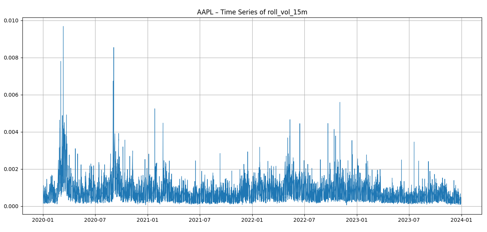

*Wie stark sich der Preis innerhalb von jeweils 15 Minuten verändert hat.*

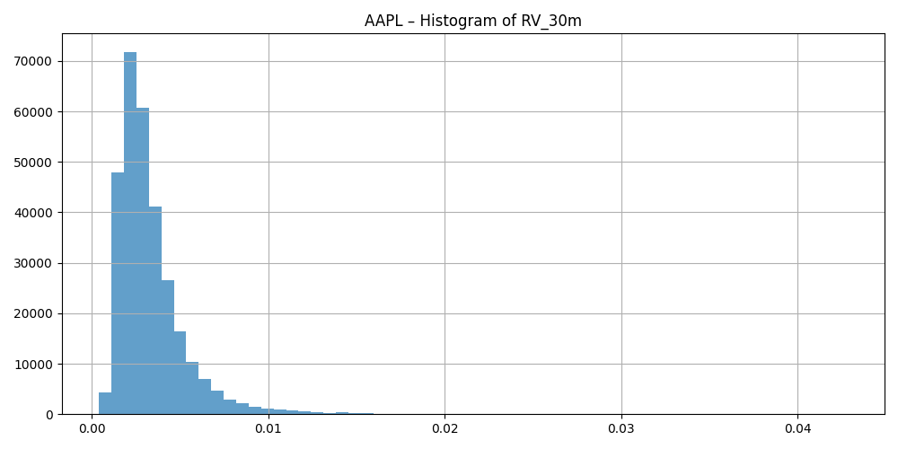

*Es gibt nur sehr selten sehr hohe Volatilität.*

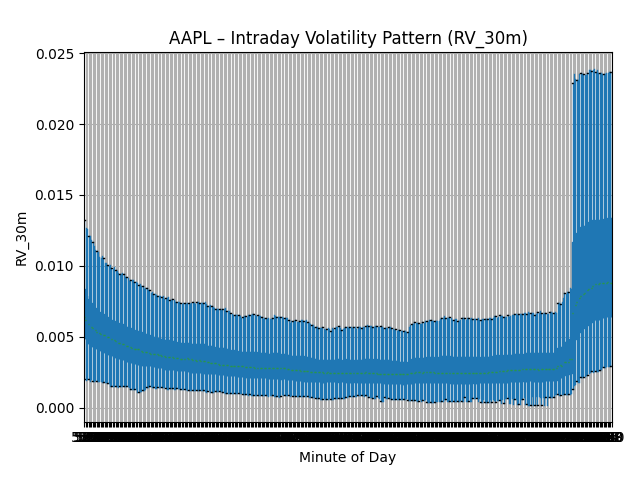

*Volatilität ist zum Tagesstart und Tagesende deutlich erhöht.*

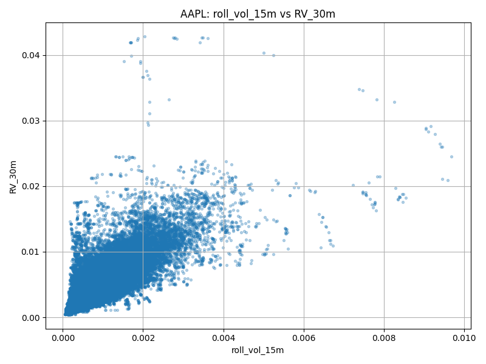

*Höhere kurzfristige Volatilität geht meist mit höherer zukünftiger Volatilität einher.*

### Data after feature engineering
[`features_example.csv`](data/features_example.csv)

---

## Step 4 – Split Data

Pro Split (Train/Validation/Test) werden alle {symbol}_{split}.parquet Dateien gesammelt. 
Daten werden gemischt (shuffle), damit Training effizienter ist. 
Danach werden sie in mehrere Shards gespeichert, um RAM-schonend trainieren zu können.

### Script
[`shuffle.py`](scripts/04_split_data/shuffle.py)

---

## Step 5 – Post-Split Preparation

Nach Sharding sind keine weiteren Schritte notwendig.

---

## Step 6 – Feature Selection

Der Random Forest erkennt **nichtlineare Zusammenhänge** zwischen Features
und dem Volatilitäts-Label und liefert ein klares Ranking der Feature-Wichtigkeiten.

### Script
[`main.py`](scripts/06_feature_selection/main.py)

### Feature Importance

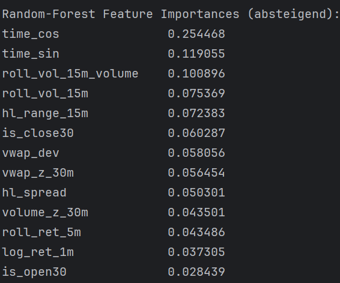

*Zeitbasierte Muster und kurzfristige Volatilitäts-Features sind am wichtigsten.*

---

## Step 7 – Model Training

Für das Modelltraining wurde **Gradient Boosted Trees (LightGBM)** verwendet.

### Warum GBT?
- Sehr gut geeignet für tabellarische Daten
- Kann nicht-lineare Zusammenhänge lernen
- Stabil und schnell im Training
- Keine komplexe Sequenzstruktur nötig (im Gegensatz zu LSTM)Input: Feature-Spalten aus `features.txt` (+ symbol als kategoriales Feature)

### Input (Features):
- Preis-Features (Returns, Volatilität)
- Volumen-Features
- VWAP-Abweichung
- Handelsbereich (High-Low)
- Zeit-Features (Minute im Handelstag)
- Aktien-Symbol als kategoriales Feature

### Output:
- Wahrscheinlichkeit p(t), dass in den nächsten 30 Minuten hohe Volatilität auftritt

### Ergebnisse
- Das Modell erreicht eine AUC von über 0.90. 
- Das zeigt, dass das Modell sehr gut zwischen ruhigen und volatilen Phasen unterscheiden kann.

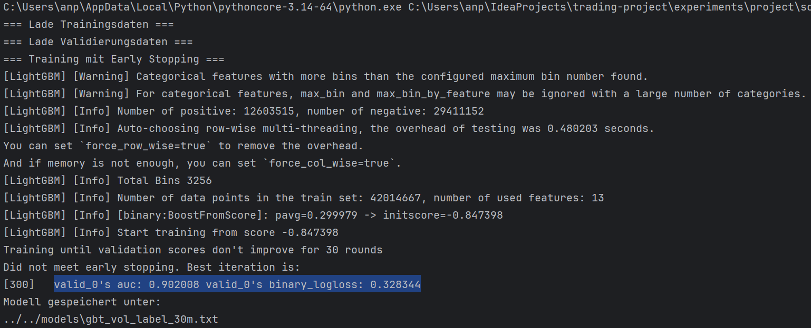

### Baseline
- Als Baseline wurde ein konstantes Modell, das immer die durchschnittliche Volatilitätswahrscheinlichkeit ausgibt, verwendet.
- Das Modell übertrifft diese Baseline deutlich.

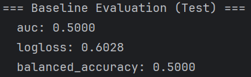

---

## Step 8 – Model Testing 

Was passiert, wenn man die Risiko-Vorhersagen des Modells zum Handeln verwendet?

### Ableitung der Handelsstrategie
- Das Modell gibt eine Wahrscheinlichkeit p(t) für hohe Volatilität aus.
- Strategie setzt Exposure (Investitionsgrad) als: `w(t) = 1 - p(t)`
- Es gibt keine klassischen Kauf- oder Verkaufssignale. Die Investitionsgröße wird kontinuierlich angepasst.

### Prozess
- Out-of-Sample-Test auf dem Testzeitraum
- Ausführung mit 1-Minute Verzögerung (kein Look-Ahead)
- Transaktionskosten werden berücksichtigt
- Vergleich mit einer Buy-and-Hold-Benchmark

### Ergebnisse
#### Equity Curve
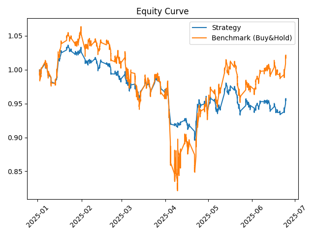
- Die Strategie erzielt eine geringere Gesamtrendite als Buy-and-Hold
- In starken Marktphasen sind die Verluste jedoch deutlich geringer
- Die Strategie reduziert Risiko, verzichtet aber auf Rendite.

#### Performance-Tabelle
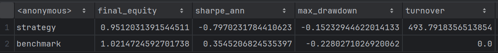
- Besonders der geringere Drawdown zeigt,
dass die Strategie in Stressphasen Kapital schützt.

#### Einzelne Aktie an einem Tag
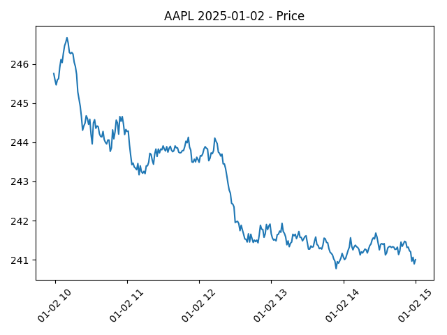

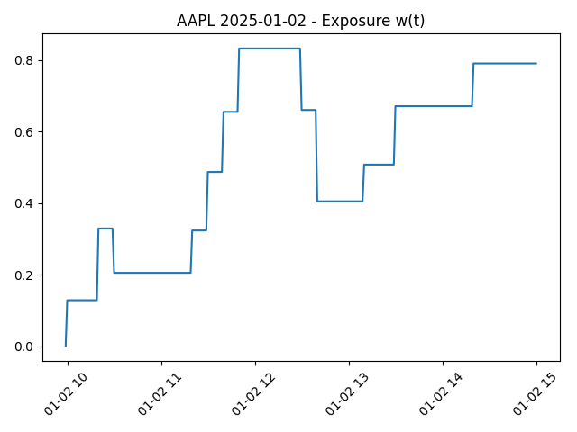
- Das Modell erkennt erhöhte Volatilität.
- Die Strategie reduziert daraufhin die Investitionsgröße.

#### Verteilung der Trading-Aktivität
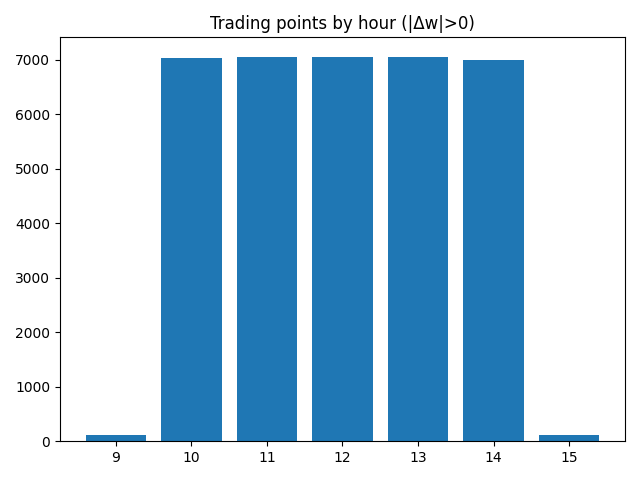

*Der Plot zeigt, zu welchen Uhrzeiten meine Strategie handelt.*

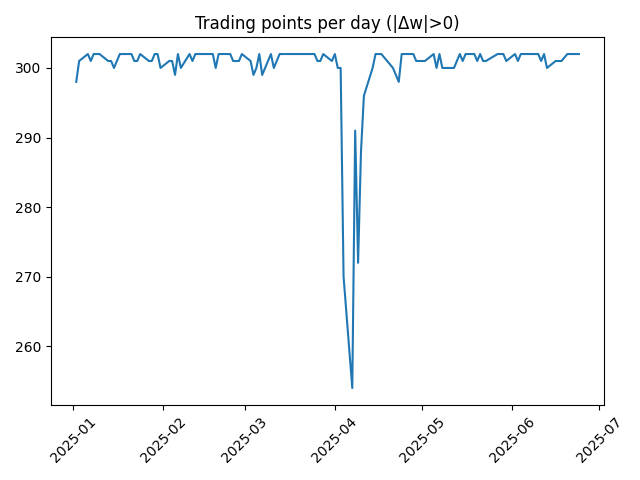

*Der zweite Plot zeigt die Anzahl der Trades pro Tag.*

### Fazit
Ein gutes Vorhersagemodell garantiert keine profitable Handelsstrategie.

---

## Step 9 – Deployment
